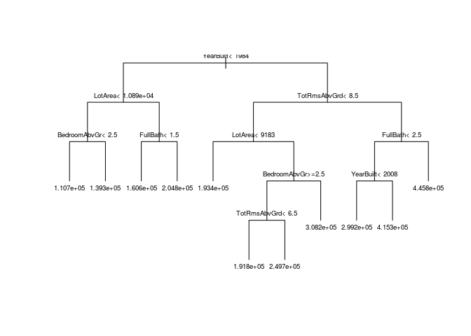

# Starting your machine learning project


```r
# load in the tidyverse package
library(tidyverse) # Utility functions
```

```
## ── Attaching packages ────────────────────────────────── tidyverse 1.2.1 ──
```

```
## ✔ ggplot2 2.2.1     ✔ purrr   0.2.5
## ✔ tibble  1.4.2     ✔ dplyr   0.7.5
## ✔ tidyr   0.8.1     ✔ stringr 1.3.1
## ✔ readr   1.1.1     ✔ forcats 0.3.0
```

```
## ── Conflicts ───────────────────────────────────── tidyverse_conflicts() ──
## ✖ dplyr::filter() masks stats::filter()
## ✖ dplyr::lag()    masks stats::lag()
```

```r
library(data.table) # Better data.frame
```

```
## 
## Attaching package: 'data.table'
```

```
## The following objects are masked from 'package:dplyr':
## 
##     between, first, last
```

```
## The following object is masked from 'package:purrr':
## 
##     transpose
```

```r
library(rpart) # for regression trees
library(randomForest) # for random forests
```

```
## randomForest 4.6-14
```

```
## Type rfNews() to see new features/changes/bug fixes.
```

```
## 
## Attaching package: 'randomForest'
```

```
## The following object is masked from 'package:dplyr':
## 
##     combine
```

```
## The following object is masked from 'package:ggplot2':
## 
##     margin
```

```r
# package with the mae function
library(modelr)
```


```r
# Using data.table
iowa_table <- fread("data/train.csv") 
iowa_table <- iowa_table[, Condition1 := as.factor(Condition1)]
```


```r
str(iowa_table)
```

```
## Classes 'data.table' and 'data.frame':	1460 obs. of  81 variables:
##  $ Id           : int  1 2 3 4 5 6 7 8 9 10 ...
##  $ MSSubClass   : int  60 20 60 70 60 50 20 60 50 190 ...
##  $ MSZoning     : chr  "RL" "RL" "RL" "RL" ...
##  $ LotFrontage  : int  65 80 68 60 84 85 75 NA 51 50 ...
##  $ LotArea      : int  8450 9600 11250 9550 14260 14115 10084 10382 6120 7420 ...
##  $ Street       : chr  "Pave" "Pave" "Pave" "Pave" ...
##  $ Alley        : chr  NA NA NA NA ...
##  $ LotShape     : chr  "Reg" "Reg" "IR1" "IR1" ...
##  $ LandContour  : chr  "Lvl" "Lvl" "Lvl" "Lvl" ...
##  $ Utilities    : chr  "AllPub" "AllPub" "AllPub" "AllPub" ...
##  $ LotConfig    : chr  "Inside" "FR2" "Inside" "Corner" ...
##  $ LandSlope    : chr  "Gtl" "Gtl" "Gtl" "Gtl" ...
##  $ Neighborhood : chr  "CollgCr" "Veenker" "CollgCr" "Crawfor" ...
##  $ Condition1   : Factor w/ 9 levels "Artery","Feedr",..: 3 2 3 3 3 3 3 5 1 1 ...
##  $ Condition2   : chr  "Norm" "Norm" "Norm" "Norm" ...
##  $ BldgType     : chr  "1Fam" "1Fam" "1Fam" "1Fam" ...
##  $ HouseStyle   : chr  "2Story" "1Story" "2Story" "2Story" ...
##  $ OverallQual  : int  7 6 7 7 8 5 8 7 7 5 ...
##  $ OverallCond  : int  5 8 5 5 5 5 5 6 5 6 ...
##  $ YearBuilt    : int  2003 1976 2001 1915 2000 1993 2004 1973 1931 1939 ...
##  $ YearRemodAdd : int  2003 1976 2002 1970 2000 1995 2005 1973 1950 1950 ...
##  $ RoofStyle    : chr  "Gable" "Gable" "Gable" "Gable" ...
##  $ RoofMatl     : chr  "CompShg" "CompShg" "CompShg" "CompShg" ...
##  $ Exterior1st  : chr  "VinylSd" "MetalSd" "VinylSd" "Wd Sdng" ...
##  $ Exterior2nd  : chr  "VinylSd" "MetalSd" "VinylSd" "Wd Shng" ...
##  $ MasVnrType   : chr  "BrkFace" "None" "BrkFace" "None" ...
##  $ MasVnrArea   : int  196 0 162 0 350 0 186 240 0 0 ...
##  $ ExterQual    : chr  "Gd" "TA" "Gd" "TA" ...
##  $ ExterCond    : chr  "TA" "TA" "TA" "TA" ...
##  $ Foundation   : chr  "PConc" "CBlock" "PConc" "BrkTil" ...
##  $ BsmtQual     : chr  "Gd" "Gd" "Gd" "TA" ...
##  $ BsmtCond     : chr  "TA" "TA" "TA" "Gd" ...
##  $ BsmtExposure : chr  "No" "Gd" "Mn" "No" ...
##  $ BsmtFinType1 : chr  "GLQ" "ALQ" "GLQ" "ALQ" ...
##  $ BsmtFinSF1   : int  706 978 486 216 655 732 1369 859 0 851 ...
##  $ BsmtFinType2 : chr  "Unf" "Unf" "Unf" "Unf" ...
##  $ BsmtFinSF2   : int  0 0 0 0 0 0 0 32 0 0 ...
##  $ BsmtUnfSF    : int  150 284 434 540 490 64 317 216 952 140 ...
##  $ TotalBsmtSF  : int  856 1262 920 756 1145 796 1686 1107 952 991 ...
##  $ Heating      : chr  "GasA" "GasA" "GasA" "GasA" ...
##  $ HeatingQC    : chr  "Ex" "Ex" "Ex" "Gd" ...
##  $ CentralAir   : chr  "Y" "Y" "Y" "Y" ...
##  $ Electrical   : chr  "SBrkr" "SBrkr" "SBrkr" "SBrkr" ...
##  $ 1stFlrSF     : int  856 1262 920 961 1145 796 1694 1107 1022 1077 ...
##  $ 2ndFlrSF     : int  854 0 866 756 1053 566 0 983 752 0 ...
##  $ LowQualFinSF : int  0 0 0 0 0 0 0 0 0 0 ...
##  $ GrLivArea    : int  1710 1262 1786 1717 2198 1362 1694 2090 1774 1077 ...
##  $ BsmtFullBath : int  1 0 1 1 1 1 1 1 0 1 ...
##  $ BsmtHalfBath : int  0 1 0 0 0 0 0 0 0 0 ...
##  $ FullBath     : int  2 2 2 1 2 1 2 2 2 1 ...
##  $ HalfBath     : int  1 0 1 0 1 1 0 1 0 0 ...
##  $ BedroomAbvGr : int  3 3 3 3 4 1 3 3 2 2 ...
##  $ KitchenAbvGr : int  1 1 1 1 1 1 1 1 2 2 ...
##  $ KitchenQual  : chr  "Gd" "TA" "Gd" "Gd" ...
##  $ TotRmsAbvGrd : int  8 6 6 7 9 5 7 7 8 5 ...
##  $ Functional   : chr  "Typ" "Typ" "Typ" "Typ" ...
##  $ Fireplaces   : int  0 1 1 1 1 0 1 2 2 2 ...
##  $ FireplaceQu  : chr  NA "TA" "TA" "Gd" ...
##  $ GarageType   : chr  "Attchd" "Attchd" "Attchd" "Detchd" ...
##  $ GarageYrBlt  : int  2003 1976 2001 1998 2000 1993 2004 1973 1931 1939 ...
##  $ GarageFinish : chr  "RFn" "RFn" "RFn" "Unf" ...
##  $ GarageCars   : int  2 2 2 3 3 2 2 2 2 1 ...
##  $ GarageArea   : int  548 460 608 642 836 480 636 484 468 205 ...
##  $ GarageQual   : chr  "TA" "TA" "TA" "TA" ...
##  $ GarageCond   : chr  "TA" "TA" "TA" "TA" ...
##  $ PavedDrive   : chr  "Y" "Y" "Y" "Y" ...
##  $ WoodDeckSF   : int  0 298 0 0 192 40 255 235 90 0 ...
##  $ OpenPorchSF  : int  61 0 42 35 84 30 57 204 0 4 ...
##  $ EnclosedPorch: int  0 0 0 272 0 0 0 228 205 0 ...
##  $ 3SsnPorch    : int  0 0 0 0 0 320 0 0 0 0 ...
##  $ ScreenPorch  : int  0 0 0 0 0 0 0 0 0 0 ...
##  $ PoolArea     : int  0 0 0 0 0 0 0 0 0 0 ...
##  $ PoolQC       : chr  NA NA NA NA ...
##  $ Fence        : chr  NA NA NA NA ...
##  $ MiscFeature  : chr  NA NA NA NA ...
##  $ MiscVal      : int  0 0 0 0 0 700 0 350 0 0 ...
##  $ MoSold       : int  2 5 9 2 12 10 8 11 4 1 ...
##  $ YrSold       : int  2008 2007 2008 2006 2008 2009 2007 2009 2008 2008 ...
##  $ SaleType     : chr  "WD" "WD" "WD" "WD" ...
##  $ SaleCondition: chr  "Normal" "Normal" "Normal" "Abnorml" ...
##  $ SalePrice    : int  208500 181500 223500 140000 250000 143000 307000 200000 129900 118000 ...
##  - attr(*, ".internal.selfref")=<externalptr>
```

```r
summary(iowa_table)
```

```
##        Id           MSSubClass      MSZoning          LotFrontage    
##  Min.   :   1.0   Min.   : 20.0   Length:1460        Min.   : 21.00  
##  1st Qu.: 365.8   1st Qu.: 20.0   Class :character   1st Qu.: 59.00  
##  Median : 730.5   Median : 50.0   Mode  :character   Median : 69.00  
##  Mean   : 730.5   Mean   : 56.9                      Mean   : 70.05  
##  3rd Qu.:1095.2   3rd Qu.: 70.0                      3rd Qu.: 80.00  
##  Max.   :1460.0   Max.   :190.0                      Max.   :313.00  
##                                                      NA's   :259     
##     LotArea          Street             Alley             LotShape        
##  Min.   :  1300   Length:1460        Length:1460        Length:1460       
##  1st Qu.:  7554   Class :character   Class :character   Class :character  
##  Median :  9478   Mode  :character   Mode  :character   Mode  :character  
##  Mean   : 10517                                                           
##  3rd Qu.: 11602                                                           
##  Max.   :215245                                                           
##                                                                           
##  LandContour         Utilities          LotConfig        
##  Length:1460        Length:1460        Length:1460       
##  Class :character   Class :character   Class :character  
##  Mode  :character   Mode  :character   Mode  :character  
##                                                          
##                                                          
##                                                          
##                                                          
##   LandSlope         Neighborhood         Condition1    Condition2       
##  Length:1460        Length:1460        Norm   :1260   Length:1460       
##  Class :character   Class :character   Feedr  :  81   Class :character  
##  Mode  :character   Mode  :character   Artery :  48   Mode  :character  
##                                        RRAn   :  26                     
##                                        PosN   :  19                     
##                                        RRAe   :  11                     
##                                        (Other):  15                     
##    BldgType          HouseStyle         OverallQual      OverallCond   
##  Length:1460        Length:1460        Min.   : 1.000   Min.   :1.000  
##  Class :character   Class :character   1st Qu.: 5.000   1st Qu.:5.000  
##  Mode  :character   Mode  :character   Median : 6.000   Median :5.000  
##                                        Mean   : 6.099   Mean   :5.575  
##                                        3rd Qu.: 7.000   3rd Qu.:6.000  
##                                        Max.   :10.000   Max.   :9.000  
##                                                                        
##    YearBuilt     YearRemodAdd   RoofStyle           RoofMatl        
##  Min.   :1872   Min.   :1950   Length:1460        Length:1460       
##  1st Qu.:1954   1st Qu.:1967   Class :character   Class :character  
##  Median :1973   Median :1994   Mode  :character   Mode  :character  
##  Mean   :1971   Mean   :1985                                        
##  3rd Qu.:2000   3rd Qu.:2004                                        
##  Max.   :2010   Max.   :2010                                        
##                                                                     
##  Exterior1st        Exterior2nd         MasVnrType          MasVnrArea    
##  Length:1460        Length:1460        Length:1460        Min.   :   0.0  
##  Class :character   Class :character   Class :character   1st Qu.:   0.0  
##  Mode  :character   Mode  :character   Mode  :character   Median :   0.0  
##                                                           Mean   : 103.7  
##                                                           3rd Qu.: 166.0  
##                                                           Max.   :1600.0  
##                                                           NA's   :8       
##   ExterQual          ExterCond          Foundation       
##  Length:1460        Length:1460        Length:1460       
##  Class :character   Class :character   Class :character  
##  Mode  :character   Mode  :character   Mode  :character  
##                                                          
##                                                          
##                                                          
##                                                          
##    BsmtQual           BsmtCond         BsmtExposure      
##  Length:1460        Length:1460        Length:1460       
##  Class :character   Class :character   Class :character  
##  Mode  :character   Mode  :character   Mode  :character  
##                                                          
##                                                          
##                                                          
##                                                          
##  BsmtFinType1         BsmtFinSF1     BsmtFinType2         BsmtFinSF2     
##  Length:1460        Min.   :   0.0   Length:1460        Min.   :   0.00  
##  Class :character   1st Qu.:   0.0   Class :character   1st Qu.:   0.00  
##  Mode  :character   Median : 383.5   Mode  :character   Median :   0.00  
##                     Mean   : 443.6                      Mean   :  46.55  
##                     3rd Qu.: 712.2                      3rd Qu.:   0.00  
##                     Max.   :5644.0                      Max.   :1474.00  
##                                                                          
##    BsmtUnfSF       TotalBsmtSF       Heating           HeatingQC        
##  Min.   :   0.0   Min.   :   0.0   Length:1460        Length:1460       
##  1st Qu.: 223.0   1st Qu.: 795.8   Class :character   Class :character  
##  Median : 477.5   Median : 991.5   Mode  :character   Mode  :character  
##  Mean   : 567.2   Mean   :1057.4                                        
##  3rd Qu.: 808.0   3rd Qu.:1298.2                                        
##  Max.   :2336.0   Max.   :6110.0                                        
##                                                                         
##   CentralAir         Electrical           1stFlrSF       2ndFlrSF   
##  Length:1460        Length:1460        Min.   : 334   Min.   :   0  
##  Class :character   Class :character   1st Qu.: 882   1st Qu.:   0  
##  Mode  :character   Mode  :character   Median :1087   Median :   0  
##                                        Mean   :1163   Mean   : 347  
##                                        3rd Qu.:1391   3rd Qu.: 728  
##                                        Max.   :4692   Max.   :2065  
##                                                                     
##   LowQualFinSF       GrLivArea     BsmtFullBath     BsmtHalfBath    
##  Min.   :  0.000   Min.   : 334   Min.   :0.0000   Min.   :0.00000  
##  1st Qu.:  0.000   1st Qu.:1130   1st Qu.:0.0000   1st Qu.:0.00000  
##  Median :  0.000   Median :1464   Median :0.0000   Median :0.00000  
##  Mean   :  5.845   Mean   :1515   Mean   :0.4253   Mean   :0.05753  
##  3rd Qu.:  0.000   3rd Qu.:1777   3rd Qu.:1.0000   3rd Qu.:0.00000  
##  Max.   :572.000   Max.   :5642   Max.   :3.0000   Max.   :2.00000  
##                                                                     
##     FullBath        HalfBath       BedroomAbvGr    KitchenAbvGr  
##  Min.   :0.000   Min.   :0.0000   Min.   :0.000   Min.   :0.000  
##  1st Qu.:1.000   1st Qu.:0.0000   1st Qu.:2.000   1st Qu.:1.000  
##  Median :2.000   Median :0.0000   Median :3.000   Median :1.000  
##  Mean   :1.565   Mean   :0.3829   Mean   :2.866   Mean   :1.047  
##  3rd Qu.:2.000   3rd Qu.:1.0000   3rd Qu.:3.000   3rd Qu.:1.000  
##  Max.   :3.000   Max.   :2.0000   Max.   :8.000   Max.   :3.000  
##                                                                  
##  KitchenQual         TotRmsAbvGrd     Functional          Fireplaces   
##  Length:1460        Min.   : 2.000   Length:1460        Min.   :0.000  
##  Class :character   1st Qu.: 5.000   Class :character   1st Qu.:0.000  
##  Mode  :character   Median : 6.000   Mode  :character   Median :1.000  
##                     Mean   : 6.518                      Mean   :0.613  
##                     3rd Qu.: 7.000                      3rd Qu.:1.000  
##                     Max.   :14.000                      Max.   :3.000  
##                                                                        
##  FireplaceQu         GarageType         GarageYrBlt   GarageFinish      
##  Length:1460        Length:1460        Min.   :1900   Length:1460       
##  Class :character   Class :character   1st Qu.:1961   Class :character  
##  Mode  :character   Mode  :character   Median :1980   Mode  :character  
##                                        Mean   :1979                     
##                                        3rd Qu.:2002                     
##                                        Max.   :2010                     
##                                        NA's   :81                       
##    GarageCars      GarageArea      GarageQual         GarageCond       
##  Min.   :0.000   Min.   :   0.0   Length:1460        Length:1460       
##  1st Qu.:1.000   1st Qu.: 334.5   Class :character   Class :character  
##  Median :2.000   Median : 480.0   Mode  :character   Mode  :character  
##  Mean   :1.767   Mean   : 473.0                                        
##  3rd Qu.:2.000   3rd Qu.: 576.0                                        
##  Max.   :4.000   Max.   :1418.0                                        
##                                                                        
##   PavedDrive          WoodDeckSF      OpenPorchSF     EnclosedPorch   
##  Length:1460        Min.   :  0.00   Min.   :  0.00   Min.   :  0.00  
##  Class :character   1st Qu.:  0.00   1st Qu.:  0.00   1st Qu.:  0.00  
##  Mode  :character   Median :  0.00   Median : 25.00   Median :  0.00  
##                     Mean   : 94.24   Mean   : 46.66   Mean   : 21.95  
##                     3rd Qu.:168.00   3rd Qu.: 68.00   3rd Qu.:  0.00  
##                     Max.   :857.00   Max.   :547.00   Max.   :552.00  
##                                                                       
##    3SsnPorch       ScreenPorch        PoolArea          PoolQC         
##  Min.   :  0.00   Min.   :  0.00   Min.   :  0.000   Length:1460       
##  1st Qu.:  0.00   1st Qu.:  0.00   1st Qu.:  0.000   Class :character  
##  Median :  0.00   Median :  0.00   Median :  0.000   Mode  :character  
##  Mean   :  3.41   Mean   : 15.06   Mean   :  2.759                     
##  3rd Qu.:  0.00   3rd Qu.:  0.00   3rd Qu.:  0.000                     
##  Max.   :508.00   Max.   :480.00   Max.   :738.000                     
##                                                                        
##     Fence           MiscFeature           MiscVal             MoSold      
##  Length:1460        Length:1460        Min.   :    0.00   Min.   : 1.000  
##  Class :character   Class :character   1st Qu.:    0.00   1st Qu.: 5.000  
##  Mode  :character   Mode  :character   Median :    0.00   Median : 6.000  
##                                        Mean   :   43.49   Mean   : 6.322  
##                                        3rd Qu.:    0.00   3rd Qu.: 8.000  
##                                        Max.   :15500.00   Max.   :12.000  
##                                                                           
##      YrSold       SaleType         SaleCondition        SalePrice     
##  Min.   :2006   Length:1460        Length:1460        Min.   : 34900  
##  1st Qu.:2007   Class :character   Class :character   1st Qu.:129975  
##  Median :2008   Mode  :character   Mode  :character   Median :163000  
##  Mean   :2008                                         Mean   :180921  
##  3rd Qu.:2009                                         3rd Qu.:214000  
##  Max.   :2010                                         Max.   :755000  
## 
```


```r
#str(iowa_table)
#names(iowa_table)
summary(iowa_table[,SalePrice])
```

```
##    Min. 1st Qu.  Median    Mean 3rd Qu.    Max. 
##   34900  129975  163000  180921  214000  755000
```

# Running your first model


```r
# print a list of the column names
sort(names(iowa_table), decreasing = F)
```

```
##  [1] "1stFlrSF"      "2ndFlrSF"      "3SsnPorch"     "Alley"        
##  [5] "BedroomAbvGr"  "BldgType"      "BsmtCond"      "BsmtExposure" 
##  [9] "BsmtFinSF1"    "BsmtFinSF2"    "BsmtFinType1"  "BsmtFinType2" 
## [13] "BsmtFullBath"  "BsmtHalfBath"  "BsmtQual"      "BsmtUnfSF"    
## [17] "CentralAir"    "Condition1"    "Condition2"    "Electrical"   
## [21] "EnclosedPorch" "ExterCond"     "Exterior1st"   "Exterior2nd"  
## [25] "ExterQual"     "Fence"         "FireplaceQu"   "Fireplaces"   
## [29] "Foundation"    "FullBath"      "Functional"    "GarageArea"   
## [33] "GarageCars"    "GarageCond"    "GarageFinish"  "GarageQual"   
## [37] "GarageType"    "GarageYrBlt"   "GrLivArea"     "HalfBath"     
## [41] "Heating"       "HeatingQC"     "HouseStyle"    "Id"           
## [45] "KitchenAbvGr"  "KitchenQual"   "LandContour"   "LandSlope"    
## [49] "LotArea"       "LotConfig"     "LotFrontage"   "LotShape"     
## [53] "LowQualFinSF"  "MasVnrArea"    "MasVnrType"    "MiscFeature"  
## [57] "MiscVal"       "MoSold"        "MSSubClass"    "MSZoning"     
## [61] "Neighborhood"  "OpenPorchSF"   "OverallCond"   "OverallQual"  
## [65] "PavedDrive"    "PoolArea"      "PoolQC"        "RoofMatl"     
## [69] "RoofStyle"     "SaleCondition" "SalePrice"     "SaleType"     
## [73] "ScreenPorch"   "Street"        "TotalBsmtSF"   "TotRmsAbvGrd" 
## [77] "Utilities"     "WoodDeckSF"    "YearBuilt"     "YearRemodAdd" 
## [81] "YrSold"
```

```r
# I'll use 'SalePrice', to mimick the notebook
fit <- rpart(
    SalePrice ~  LotArea + YearBuilt + Condition1 + FullBath + BedroomAbvGr + TotRmsAbvGrd,
    data = iowa_table
)
```


```r
# plot our regression tree 
plot(fit, uniform=TRUE)
# add text labels & make them 60% as big as they are by default
text(fit, cex=.6)
```

<!-- -->


```r
print("Making predictions for the first 5 houses:")
```

```
## [1] "Making predictions for the first 5 houses:"
```

```r
#head(iowa_table)

print("The predictions are")
```

```
## [1] "The predictions are"
```

```r
predictions <- predict(fit, head(iowa_table))
print(predictions)
```

```
##        1        2        3        4        5        6 
## 193389.6 139255.8 191847.8 139255.8 299194.8 308191.8
```

```r
print("Actual price")
```

```
## [1] "Actual price"
```

```r
actualPrice <- head(iowa_table[,SalePrice])
print(actualPrice)
```

```
## [1] 208500 181500 223500 140000 250000 143000
```

```r
# Checking the MAE
iowa_mae <- mae(model = fit, data = iowa_table)
print("The MAE is:")
```

```
## [1] "The MAE is:"
```

```r
print(iowa_mae)
```

```
## [1] 33529.06
```

# How do we know if our model is good?


```r
# Your turn: split your training data into test & training sets
# split our data so that 30% is in the test set and 70% is in the training set
splitData <- resample_partition(iowa_table, c(test = 0.3, train = 0.7))
# how many cases are in test & training set? 
lapply(splitData, dim)
```

```
## $test
## [1] 437  81
## 
## $train
## [1] 1023   81
```


```r
# Fit a new model to your training set...
fit2 <- rpart(
    SalePrice ~  LotArea + YearBuilt + Condition1 + FullBath + BedroomAbvGr + TotRmsAbvGrd,
    data = splitData$train
)

# and evaluate it on your test set. Did the error get larger or smaller?
iowa_mae2 <- mae(model = fit2, data = splitData$test)
print("The new MAE is:")
```

```
## [1] "The new MAE is:"
```

```r
print(iowa_mae2)
```

```
## [1] 35051.35
```


```r
# a function to get the maximum average error for a given max depth. You should pass in
# the target as the name of the target column and the predictors as vector where
# each item in the vector is the name of the column
get_mae <- function(maxdepth, target, predictors, training_data, testing_data){
    
    # turn the predictors & target into a formula to pass to rpart()
    predictors <- paste(predictors, collapse="+")
    formula <- as.formula(paste(target,"~",predictors,sep = ""))
    
    # build our model
    model <- rpart(formula, data = training_data,
                   control = rpart.control(maxdepth = maxdepth))
    # get the mae
    mae <- mae(model, testing_data)
    return(mae)
}
```

# Underfitting/overfitting and improving your model


```r
# Your turn: use the get_mae function to find the maxdepth that leads to the 
# lowest mean average error for this dataset
target <- 'SalePrice'
predictors <- c(
  'LotArea', 'YearBuilt', 'Condition1', 'FullBath',
  'BedroomAbvGr', 'TotRmsAbvGrd'
)

for(i in 1:10) {
    mae <- get_mae(
        maxdepth = i, target = target, predictors = predictors,
        training_data = splitData$train, testing_data = splitData$test
    )
    print(paste("Maxdepth: ",i," | MAE: ",mae))
}
```

```
## [1] "Maxdepth:  1  | MAE:  43720.4139483103"
## [1] "Maxdepth:  2  | MAE:  39202.5194358791"
## [1] "Maxdepth:  3  | MAE:  36367.1738719305"
## [1] "Maxdepth:  4  | MAE:  36209.4574314718"
## [1] "Maxdepth:  5  | MAE:  35051.3506045292"
## [1] "Maxdepth:  6  | MAE:  35051.3506045292"
## [1] "Maxdepth:  7  | MAE:  35051.3506045292"
## [1] "Maxdepth:  8  | MAE:  35051.3506045292"
## [1] "Maxdepth:  9  | MAE:  35051.3506045292"
## [1] "Maxdepth:  10  | MAE:  35051.3506045292"
```


```r
# Your turn: Train a random forest using the same features as you used
# to train your original decision tree.
# Check out the MAE. Did you see an improvement over your original model?
# Fit a new model to your training set...
fitRR <- randomForest(
    SalePrice ~  LotArea + YearBuilt + Condition1 + FullBath + BedroomAbvGr + TotRmsAbvGrd,
    data = splitData$train
)

# and evaluate it on your test set. Did the error get larger or smaller?
iowa_mae_RR <- mae(model = fitRR, data = splitData$test)
print("The new MAE is:")
```

```
## [1] "The new MAE is:"
```

```r
print(iowa_mae_RR)
```

```
## [1] 29360.33
```


```r
print(iowa_mae2 - iowa_mae_RR)
```

```
## [1] 5691.022
```

```r
# However, for this to get easier to see, it'd need to be converted into a percentage of sorts...
```
# Testing on the test data


```r
iowa_test <- fread("data/test.csv") 
iowa_test <- iowa_test[, Condition1 := as.factor(Condition1)]
iowa_test <- iowa_test[, SalePrice := predict(fitRR, .SD)]
```

# Making it ready for submission
This is the lesson 8, not sure why it isn't properly done on this notebook...


```r
# create a dataframe with our results
my_submission <- data.table(
  'Id' = as.integer(iowa_test$Id), 'SalePrice' = iowa_test$SalePrice
)
# save our file
fwrite(my_submission, 'submission.csv')
```
